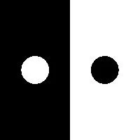
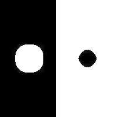
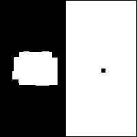
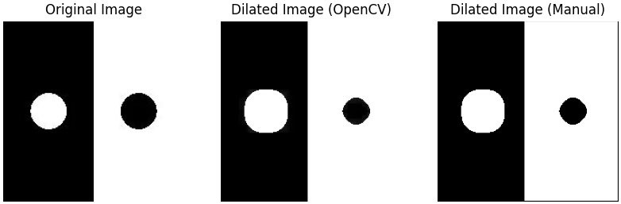
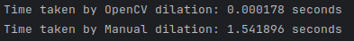

ЛР1 
Цель работы:

Научиться реализовывать один из простых алгоритмов обработки изображений.

Вариант:

**5. Дилатация (размер примитива 3 на 3)**

## 1._Теоритическая база_

Математическая морфология - это теория, которая зародилась еще в 1964 году, когда Джордж Матерон изучал соотношение геометрии пористой среды и их проницаемости. В то же время Жан Серра попытался количественно оценить петрографию (т.е Макроскопические и микроскопические исследования горных пород) железных руд, а также результаты исследования Серра в 1982 году.

Математическая морфология изначально подразумевает под собой теорию множеств и все операции были определены на множествах, сегодня мы с вами рассмотрим, как можно использовать эту теорию для обработки и анализа изображений.

Теоретически, математическая морфология может применяться в любой области обработки изображений, где форма играет некоторую роль. Это может быть обработка объектов, обработка шума, выделение краев, сегментация, анализ текстуры, классификация, описание формы и т.д.

Сжатие(erosion) — это процесс удаления белых пикселей с границ изображения. Заменяет значение пикселя минимальным значением девяти пикселей в массиве 3x3, центрированном вокруг пикселя. В бинарном изображении это означает, что пиксель будет иметь нулевое значение, если любой из его соседних пикселей равен нулю.


Дилатация – процесс, противоположный эрозии. Белые пиксели добавляются к границам бинарного изображения.

Можно использовать эрозию и дилатацию вместе, чтобы заполнить дыры и удалить мелкие объекты из бинарного изображения.

## 2. Описание разработанной системы

Для выполнения лабораторной работы было взято исходное изображение:



Для начала исходное изображение было загруженно 


```python
filename = "dot_and_hole"
img = cv.imread(f'data/{filename}.jpg', cv.IMREAD_GRAYSCALE)
```

Затем, для проведения дилатации средствами openCV были заданы параметры. Также взяты замеры времени до начала работы метода и после

```python
# Параметры для дилатации
kernel = np.ones((3, 3), np.uint8)

# Измеряем время выполнения дилатации с использованием OpenCV
start_cv = time.time()  # Начало замера времени
dilated_img_cv = cv.dilate(img, kernel, iterations=4)
end_cv = time.time()  # Конец замера времени
cv_time = end_cv - start_cv  # Время выполнения OpenCV
```

В качестве нативной реализации на python написана функция, которая обходит всё изображение по пикселям и сравнивает соседние, в диапазоне примитива 3 на 3, пиксели. Если в выбранной области имеется хотя бы один белый пиксель то выходной пиксель также устанавливается в белый цвет

```python
def dilate_manual(image, kernel):
    # Получаем размеры изображения и ядра
    img_height, img_width = image.shape
    kernel_height, kernel_width = kernel.shape

    # Создаем выходное изображение с теми же размерами
    dilated_image = np.zeros_like(image)

    # Вычисляем отступы для ядра
    pad_height = kernel_height // 3
    pad_width = kernel_width // 3

    # Проходим по каждому пикселю изображения
    for i in range(pad_height, img_height - pad_height):
        for j in range(pad_width, img_width - pad_width):
            # Проверяем область вокруг текущего пикселя
            region = image[i - pad_height:i + pad_height + 1, j - pad_width:j + pad_width + 1]
            # Если хотя бы один пиксель в области равен 255 (белый), устанавливаем пиксель в выходном изображении в 255
            if np.any(region * kernel):
                dilated_image[i, j] = 255

    return dilated_image
```
Также, как и с OpenCV, были заданы параметры структурного элемента и входное изображение было дополнительно преобразованно в бинарное(для корректного отображения). Таким же образом был проведен замер времени выполнения функции
```python

# Преобразуем изображение в бинарное (0 и 255)
_, binary_img = cv.threshold(img, 128, 255, cv.THRESH_BINARY)

# Создаем ядро размером 3x3
kernel = np.ones((3, 3), np.uint8)

# Измеряем время выполнения ручной реализации дилатации
start_manual = time.time()  # Начало замера времени
dilated_img_manual = dilate_manual(binary_img, kernel)
for i in range(3):
    dilated_img_manual = dilate_manual(dilated_img_manual, kernel)
end_manual = time.time()  # Конец замера времени
manual_time = end_manual - start_manual  # Время выполнения ручной реализации
```

## 3. Результаты работы и тестирования системы

В результате работы программы были полученны следующие результаты:

Исходное изобрадение:


Изображение полученное в результате дилатации методом OpenCV:




Изображение полученное в результате дилатации самописным методом:




График(plot) для нагрядного сравнения:


Сравнение времени выполнения двух алгоритмов:

