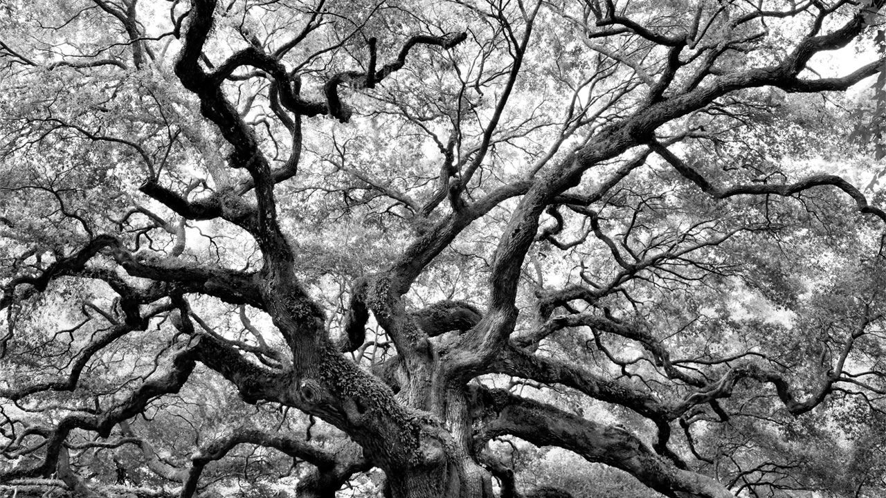
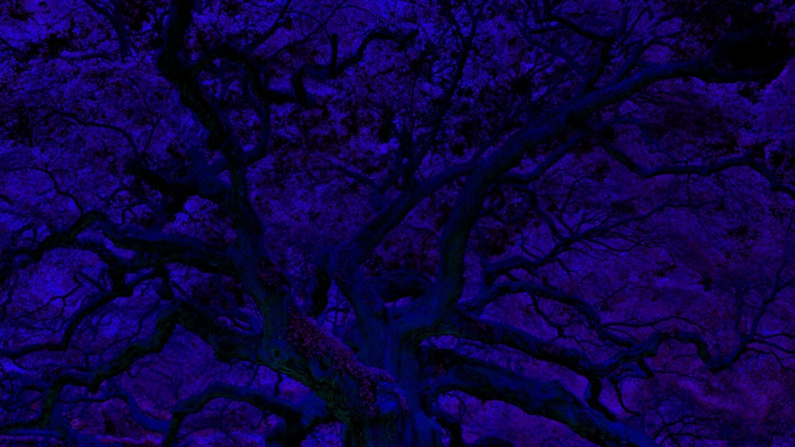
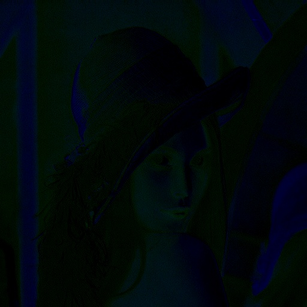
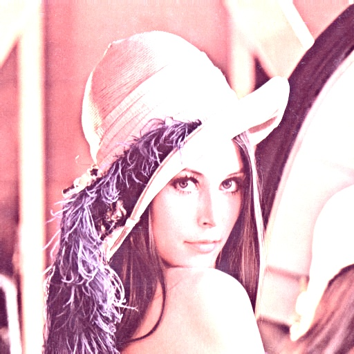
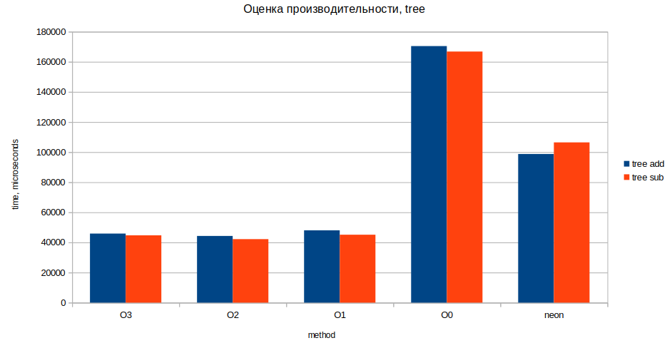
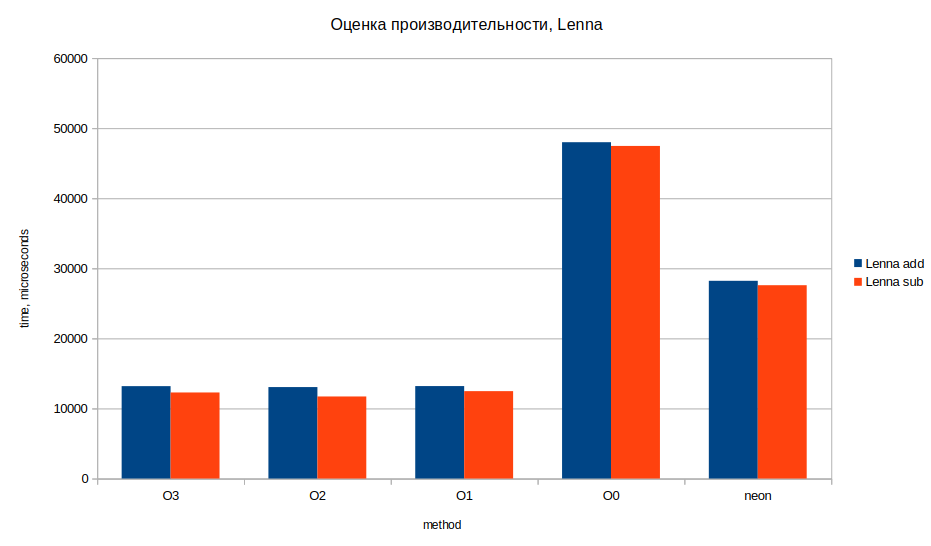
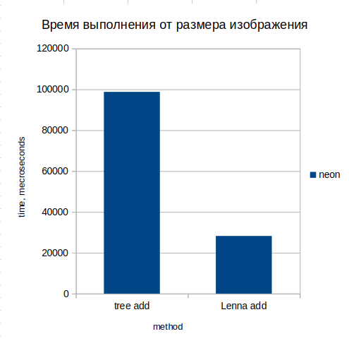
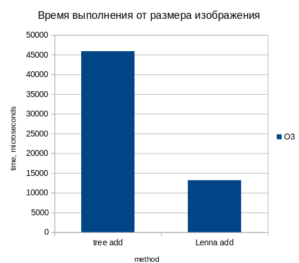

## ЛР2
## Цель работы:

Изучить основы оптимизации и векторизации алгоритмов компьютерного
зрения на базе процессорной системы ARM Cortex A57 MPCore + NEON. 

## Вариант:

2. Сложение и вычитание двух изображений

# 1. Теоретическая база 

ARM Cortex A57: Это высокопроизводительный процессор с поддержкой 64-битной архитектуры ARMv8-A и SIMD-инструкций NEON, что позволяет эффективно обрабатывать векторные данные.

NEON — это расширение архитектуры ARM, предназначенное для обработки данных с использованием SIMD (Single Instruction, Multiple Data). Это означает, что NEON позволяет выполнять одну и ту же операцию над несколькими данными одновременно, что значительно увеличивает производительность при обработке мультимедиа, графики и других вычислительно интенсивных задач.
Основные характеристики NEON

SIMD Архитектура: 

* NEON поддерживает выполнение одной инструкции над несколькими данными, что позволяет эффективно использовать ресурсы процессора.

* Регистры: NEON использует 128-битные регистры (обозначаемые как Q0-Q31), которые могут содержать несколько 8-, 16-, 32- или 64-битных элементов. Например, один 128-битный регистр может хранить четыре 32-битных числа.

* Поддержка различных типов данных: NEON может работать как с целыми числами, так и с числами с плавающей точкой, что делает его универсальным инструментом для различных приложений.

* Эффективность: Использование NEON может значительно увеличить производительность по сравнению с традиционными методами обработки данных. Например, в некоторых случаях производительность может увеличиваться в 1.6–2.5 раза по сравнению с предыдущими архитектурами ARM12.

# 2. Описание разработанной системы (алгоритмы, принципы работы, архитектура) 

## 2.1 Алгоритмы

Сложение изображений: Для каждого пикселя двух изображений выполняется операция сложения.
Вычитание изображений: Аналогично, для каждого пикселя производится вычитание.

## 2.2 Архитектура

Используется C++ с библиотекой OpenCV для работы с изображениями.
Программа включает два модуля: один для обычной обработки, другой для векторной обработки с использованием NEON.

### image_processing.cpp
```cpp 
#include <opencv2/opencv.hpp>
#include <iostream>
#include <chrono>
using namespace std;
void addImages(const cv::Mat& img1, const cv::Mat& img2, cv::Mat& result) {
    for (int i = 0; i < img1.rows; ++i) {
        for (int j = 0; j < img1.cols; ++j) {
            result.at<cv::Vec3b>(i, j)[0] = cv::saturate_cast<uchar>(img1.at<cv::Vec3b>(i, j)[0] + img2.at<cv::Vec3b>(i, j)[0]);
            result.at<cv::Vec3b>(i, j)[1] = cv::saturate_cast<uchar>(img1.at<cv::Vec3b>(i, j)[1] + img2.at<cv::Vec3b>(i, j)[1]);
            result.at<cv::Vec3b>(i, j)[2] = cv::saturate_cast<uchar>(img1.at<cv::Vec3b>(i, j)[2] + img2.at<cv::Vec3b>(i, j)[2]);
        }
    }
}

void subtractImages(const cv::Mat& img1, const cv::Mat& img2, cv::Mat& result) {
    for (int i = 0; i < img1.rows; ++i) {
        for (int j = 0; j < img1.cols; ++j) {
            result.at<cv::Vec3b>(i, j)[0] = cv::saturate_cast<uchar>(img1.at<cv::Vec3b>(i, j)[0] - img2.at<cv::Vec3b>(i, j)[0]);
            result.at<cv::Vec3b>(i, j)[1] = cv::saturate_cast<uchar>(img1.at<cv::Vec3b>(i, j)[1] - img2.at<cv::Vec3b>(i, j)[1]);
            result.at<cv::Vec3b>(i, j)[2] = cv::saturate_cast<uchar>(img1.at<cv::Vec3b>(i, j)[2] - img2.at<cv::Vec3b>(i, j)[2]);
        }
    }
}

int main() {
    cv::Mat img1 = cv::imread("Lenna_gs.png");
    cv::Mat img2 = cv::imread("tree_gs.png");
    cv::Mat result(img1.size(), img1.type());
    auto start = chrono::high_resolution_clock::now();
    addImages(img1, img2, result);
    auto end = chrono::high_resolution_clock::now();
    cv::imwrite("added_image.jpg", result);
    cout << "Time taken to addition: " 
         << chrono::duration_cast<chrono::microseconds>(end - start).count() 
         << " microseconds" << endl;

    start = chrono::high_resolution_clock::now();
    subtractImages(img1, img2, result);
    end = chrono::high_resolution_clock::now();
    cv::imwrite("subtracted_image.jpg", result);
    cout << "Time taken to subsctraction: " 
         << chrono::duration_cast<chrono::microseconds>(end - start).count() 
         << " microseconds" << endl;
    return 0;
}
```
### image_processing_neon.cpp
```cpp
#include <arm_neon.h>
#include <opencv2/opencv.hpp>
#include <iostream>
#include <chrono>

using namespace std;

// Функция сложения двух изображений с использованием NEON
void addImagesWithNeon(const cv::Mat& img1, const cv::Mat& img2, cv::Mat& result) {
    for (int i = 0; i < img1.rows; ++i) {
        for (int j = 0; j < img1.cols; j += 8) { // Обрабатываем по 8 пикселей за раз
            uint8x8_t pix1_r = vld1_u8(&img1.at<cv::Vec3b>(i,j)[0]); // Красный компонент
            uint8x8_t pix1_g = vld1_u8(&img1.at<cv::Vec3b>(i,j)[1]); // Зеленый компонент
            uint8x8_t pix1_b = vld1_u8(&img1.at<cv::Vec3b>(i,j)[2]); // Синий компонент

            uint8x8_t pix2_r = vld1_u8(&img2.at<cv::Vec3b>(i,j)[0]);
            uint8x8_t pix2_g = vld1_u8(&img2.at<cv::Vec3b>(i,j)[1]);
            uint8x8_t pix2_b = vld1_u8(&img2.at<cv::Vec3b>(i,j)[2]);

            // Сложение
            uint8x8_t result_r = vqadd_u8(pix1_r, pix2_r);
            uint8x8_t result_g = vqadd_u8(pix1_g, pix2_g);
            uint8x8_t result_b = vqadd_u8(pix1_b, pix2_b);

            vst1_u8(&result.at<cv::Vec3b>(i,j)[0], result_r);
            vst1_u8(&result.at<cv::Vec3b>(i,j)[1], result_g);
            vst1_u8(&result.at<cv::Vec3b>(i,j)[2], result_b);
        }
    }
}

// Функция вычитания двух изображений с использованием NEON
void subtractImagesWithNeon(const cv::Mat& img1, const cv::Mat& img2, cv::Mat& result) {
    for (int i = 0; i < img1.rows; ++i) {
        for (int j = 0; j < img1.cols; j += 8) { // Обрабатываем по 8 пикселей за раз
            uint8x8_t pix1_r = vld1_u8(&img1.at<cv::Vec3b>(i,j)[0]); // Красный компонент
            uint8x8_t pix1_g = vld1_u8(&img1.at<cv::Vec3b>(i,j)[1]); // Зеленый компонент
            uint8x8_t pix1_b = vld1_u8(&img1.at<cv::Vec3b>(i,j)[2]); // Синий компонент

            uint8x8_t pix2_r = vld1_u8(&img2.at<cv::Vec3b>(i,j)[0]);
            uint8x8_t pix2_g = vld1_u8(&img2.at<cv::Vec3b>(i,j)[1]);
            uint8x8_t pix2_b = vld1_u8(&img2.at<cv::Vec3b>(i,j)[2]);

            // Вычитание
            uint8x8_t result_r = vqsub_u8(pix1_r, pix2_r);
            uint8x8_t result_g = vqsub_u8(pix1_g, pix2_g);
            uint8x8_t result_b = vqsub_u8(pix1_b, pix2_b);

            vst1_u8(&result.at<cv::Vec3b>(i,j)[0], result_r);
            vst1_u8(&result.at<cv::Vec3b>(i,j)[1], result_g);
            vst1_u8(&result.at<cv::Vec3b>(i,j)[2], result_b);
        }
    }
}

int main() {
    // Загрузка изображений
    cv::Mat img1 = cv::imread("Lenna_gs.png");
    cv::Mat img2 = cv::imread("tree_gs.png");
    cv::Mat result(img1.size(), img1.type());

    // Сложение изображений с использованием NEON
    auto start = chrono::high_resolution_clock::now();
    addImagesWithNeon(img1, img2, result);
    auto end = chrono::high_resolution_clock::now();
    cv::imwrite("added_image_neon.jpg", result);
    cout << "Time taken to addition with NEON: " 
         << chrono::duration_cast<chrono::microseconds>(end - start).count() 
         << " microseconds" << endl;

    // Вычитание изображений с использованием NEON
    start = chrono::high_resolution_clock::now();
    subtractImagesWithNeon(img1, img2, result);
    end = chrono::high_resolution_clock::now();
    cv::imwrite("subtracted_image_neon.jpg", result);
    cout << "Time taken to subtraction with NEON: " 
         << chrono::duration_cast<chrono::microseconds>(end - start).count() 
         << " microseconds" << endl;

    return 0;
}
```


# 3. Результаты работы и тестирования системы

### 3.1 Исходные и полученные изображения

Для проведения эксперимента были взяты два изображения различного размера, а также их gray scale версии, для сложения и вычитания между собой.

Разрешение большего разрешения:


Его gray scale версия:



И, соответственно, изображения меньшего размера:


Его gray scale версия:


В результате работы алгоритма были получены следующие изображения:

1. Без использования Neon:

1.1 Сложение tree:


1.2 Вычитание tree:



1.3 Сложение Lenna:


1.4 Вычитание Lenna:



2. С использованием Neon
2.1 Сложение tree:


2.2 Вычитание tree:


2.3 Сложение Lenna:



2.4 Вычитание Lenna:


### 3.2 Оценка производительности

Для оценки производительности необходимо:
* Измерить время выполнения функций сложения и вычитания для различных размеров изображений.
* Использовать различные флаги оптимизации компилятора (-O0, -O1, -O2, -O3) для модуля без векторизации.
* Сравнить результаты выполнения с использованием NEON и без него.

**В ходе проведения исследования были получены следующие результаты:**

В случае эксперимента с изображениями большего размера ([tree.png](images/tree.png) и [tree_gs.png](images/tree_gs.png)) были получены следующие результаты выполнения программы:



В случае эксперимента с изображениями меньшего размера ([Lenna.png](images/Lenna.png) и [Lenna_gs.png](images/Lenna_gs.png)) были получены следующие результаты выполнения программы:



**Графики зависимости времени выполнения от размера изображения.**

Как и ожидалось, время выполнения программы напрямую зависит от размера изображения. Это подтверждается следующими графиками:

Для алгоритма с использованием Neon:



Аналогичная картина для алгоритма без Neon:



**Таблица всех результатов выполнения программы**


Результаты работы и тестирования системы
Результаты должны включать:
Скриншоты полученных изображений.
Графики зависимости времени выполнения от размера изображения.
Таблицы сравнения производительности между версиями с и без NEON.
Выводы по работе
В выводах необходимо отразить:
Эффективность использования NEON для обработки изображений.
Влияние оптимизации компилятора на производительность.
Рекомендации по дальнейшему улучшению алгоритмов.
Использованные источники
Документация ARM Cortex-A57.
Руководство по программированию NEON.
Официальная документация OpenCV.


