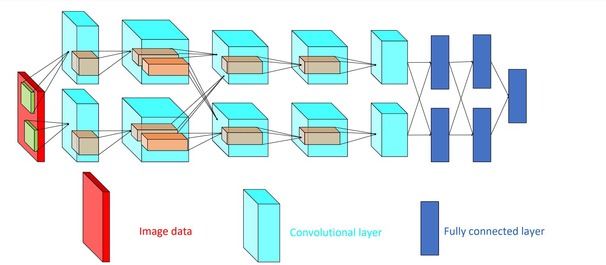
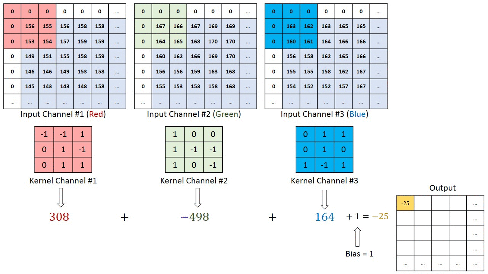
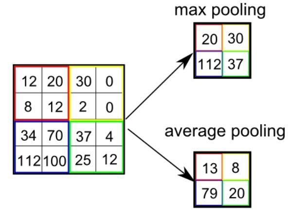
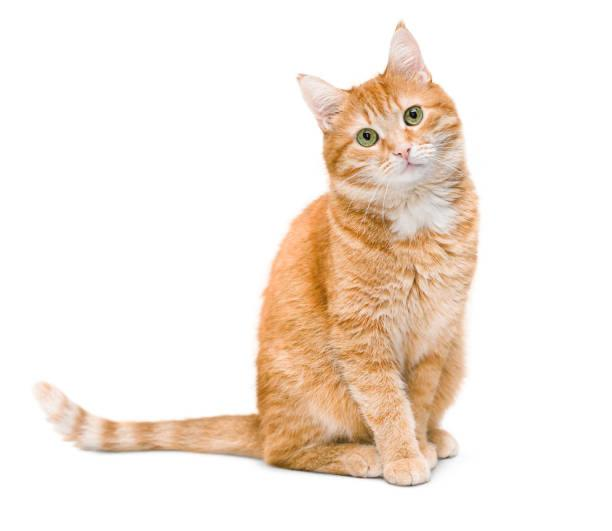
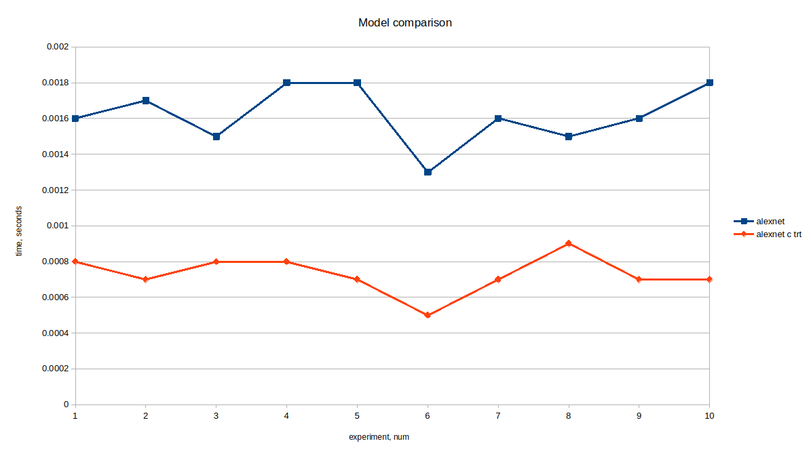

## ЛР3
## Цель работы:

Изучить основы реализации глубоких нейронных сетей на мобильных системах, а также методы их оптимизации. 


# 1. Теоретическая база
Глубокие нейронные сети представляют собой архитектуру машинного обучения, состоящую из нескольких слоев нейронов. В контексте обработки изображений часто используются сверточные нейронные сети (Convolutional Neural Networks, CNN), такие как AlexNet и ResNet, которые способны эффективно выделять особенности изображения на разных уровнях.

Оптимизация нейросетевых моделей имеет большое значение для использования на мобильных и встроенных устройствах с ограниченными ресурсами. Одним из инструментов для оптимизации является TensorRT — высокопроизводительная библиотека, которая позволяет преобразовать и ускорить работу на устройствах с GPU.

## AlexNet

 Роль CNN заключается в том, чтобы привести изображения в форму, которую легче обрабатывать, без потери признаков, имеющих решающее значение в получении хорошего прогноза.

### Свертка

Фильтр перемещается вправо с определённым значением шага, пока не проанализирует всю ширину. Двигаясь дальше, он переходит к началу изображения с тем же значением шага и повторяет процесс до тех пор, пока не проходит всё изображение.

### Слой объединения
Подобно свёрточному слою, слой объединения отвечает за уменьшение размера свёрнутого объекта в пространстве. Это делается для уменьшения необходимой при обработке данных вычислительной мощности за счёт сокращения размерности. Кроме того, это полезно для извлечения доминирующих признаков, которые являются вращательными и позиционными инвариантами, тем самым позволяя поддерживать процесс эффективного обучения модели.

Есть два типа объединения: максимальное и среднее. Первое возвращает максимальное значение из покрытой ядром части изображения. А среднее объединение возвращает среднее значение из всех значений покрытой ядром части.

Максимальное объединение также выполняет функцию шумоподавления. Оно полностью отбрасывает зашумленные активации, а также устраняет шум вместе с уменьшением размерности. С другой стороны, среднее объединение для подавления шума просто снижает размерность. Значит, можно сказать, что максимальное объединение работает намного лучше среднего объединения.


### Классификация
После преобразования входного изображения в подходящую для многоуровневого перцептрона форму мы должны сгладить изображение в вектор столбец. Сглаженный выходной сигнал подаётся на нейронную сеть с прямой связью.


# 2. Описание разработанной системы (алгоритмы, принципы работы, архитектура) 

## 2.1 Архитектура

Система была реализована в среде google colab с использованием библиотеки PyTorch и включает следующие ключевые компоненты:
Входные изображения:
1. dog.jpg
   
2. cat.jpg
   
* Предобработка изображений: Изображения изменяются до размера 224x224 пикселей и нормализуются.
* Модель: Используется предварительно обученная модель AlexNet.
* TensorRT: Модель конвертируется в формат TensorRT для ускорения инференса на GPU.

## 2.2 Алгоритмы

Для выполнения поставленной задачи был написан код:

* Модель без использования trt
```python
import torch
from torchvision.models.alexnet import alexnet
from torchvision import transforms
from PIL import Image
import time

# Функция для предобработки изображения
def preprocess_image(image_path):
    transform = transforms.Compose([
        transforms.Resize((224, 224)),  # Изменение размера изображения до 224x224
        transforms.ToTensor(),  # Преобразование в тензор
        transforms.Normalize(mean=[0.485, 0.456, 0.406], std=[0.229, 0.224, 0.225])  # Нормализация
    ])
    image = Image.open(image_path)  # Открываем изображение
    image = transform(image).unsqueeze(0)  # Преобразуем и добавляем batch размер
    return image.cuda()

# Функция для получения предсказания
def predict(image_path):
    # Загружаем и подготавливаем изображение
    image = preprocess_image(image_path)

    # Прогоняем изображение через модель
    timest = time.time()
    with torch.no_grad():  # Отключаем автоматическое вычисление градиентов
        output = model(image)
    print(f"Inference time: {time.time()-timest:.4f} seconds")

    # Получаем индекс класса с максимальной вероятностью
    _, predicted_class = torch.max(output, 1)

    # Возвращаем предсказание
    return predicted_class.item()

# Загружаем модель
timest = time.time()
model = alexnet(pretrained=True).eval().cuda()
print("Model load time: {:.4f} seconds".format(time.time()-timest))

# Пример использования
image_path = "/content/imgs/cat.jpeg"  # Укажите путь к вашему изображению
predicted_class = predict(image_path)
print(f"Predicted class index: {predicted_class}")
```

* Модель с использованием trt
```python
import torch
from torch2trt import torch2trt
from torch2trt import TRTModule
from torchvision.models.alexnet import alexnet
from torchvision import transforms
from PIL import Image
import time

# Функция для предобработки изображения
def preprocess_image(image_path):
    transform = transforms.Compose([
        transforms.Resize((224, 224)),  # Изменение размера изображения до 224x224
        transforms.ToTensor(),  # Преобразование в тензор
        transforms.Normalize(mean=[0.485, 0.456, 0.406], std=[0.229, 0.224, 0.225])  # Нормализация
    ])
    image = Image.open(image_path)  # Открываем изображение
    image = transform(image).unsqueeze(0)  # Преобразуем и добавляем batch размер
    return image.cuda()

# Функция для получения предсказания с TensorRT
def predict_with_trt(image_path):
    # Загружаем и подготавливаем изображение
    image = preprocess_image(image_path)

    # Прогоняем изображение через модель TensorRT
    timest = time.time()
    with torch.no_grad():
        output = model_trt(image)
    print(f"Inference time (TRT): {time.time()-timest:.4f} seconds")

    # Получаем индекс класса с максимальной вероятностью
    _, predicted_class = torch.max(output, 1)

    # Возвращаем предсказание
    return predicted_class.item()

# Загрузка предварительно обученной модели AlexNet и её конвертация в TensorRT (один раз)
def convert_model_to_trt():
    model = alexnet(pretrained=True).eval().cuda()

    # Примерное изображение для конвертации
    x1 = torch.ones((1, 3, 224, 224)).cuda()

    # Конвертируем модель в TensorRT
    timest = time.time()
    model_trt = torch2trt(model, [x1])
    print(f"Model conversion time to TRT: {time.time() - timest:.4f} seconds")

    # Сохраняем конвертированную модель
    torch.save(model_trt.state_dict(), 'alexnet_trt.pth')

# Загружаем модель TensorRT
def load_trt_model():
    model_trt = TRTModule()
    timest = time.time()
    model_trt.load_state_dict(torch.load('alexnet_trt.pth'))
    print(f"TRT Model load time: {time.time() - timest:.4f} seconds")
    return model_trt

# Конвертируем модель в TensorRT один раз
# Закомментируйте это, если модель уже конвертирована и сохранена
#convert_model_to_trt()

# Загружаем готовую модель TensorRT
model_trt = load_trt_model()

# Пример использования с изображением
image_path = "/content/imgs/cat.jpeg"  # Укажите путь к вашему изображению
predicted_class_trt = predict_with_trt(image_path)
print(f"Predicted class index (TRT): {predicted_class_trt}")
```

# 3. Результаты работы и тестирования системы

## 3.1. Сравнение работы моделей

В ходе экспериментов были получены следующие результаты выполнения программ:


# 4.Выводы по работе
Разработанная система демонстрирует высокую производительность при обработке изображений благодаря использованию архитектуры AlexNet и оптимизации через TensorRT. Использование сверточных нейронных сетей позволяет эффективно извлекать признаки изображений и классифицировать их с высокой точностью.

# 5. Использованные источники
AlexNet Wikipedia.

Архитектура AlexNet GeeksforGeeks.

Как архитектура AlexNet революционизировала глубокое обучение Paravision Lab.